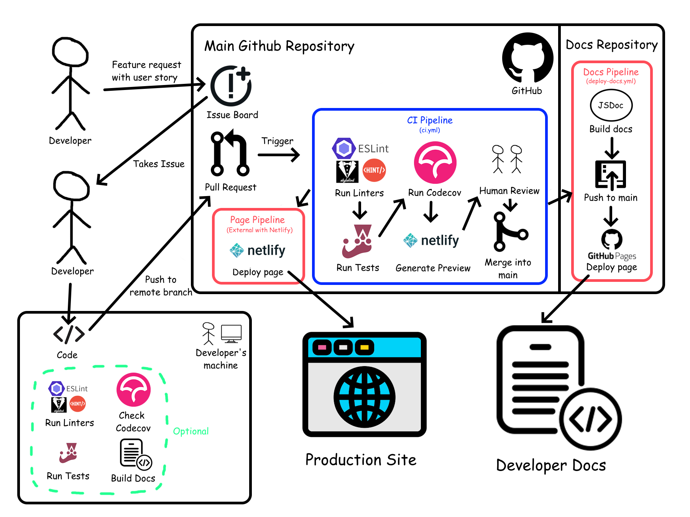

# 10x-Speech CI/CD Pipeline

## Table of Contents
1. [CI/CD Diagram](#cicd-diagram)
2. [Overview](#overview)
3. [Tools Used](#tools-used)
4. [Future Work](#future-work)

## CI/CD Diagram
This document can be used independently of the graphic, 
but the pipeline is a lot easier to follow with the 
help of the graphic:

## Overview
In this section, we give a high-level overview of the pipeline, and 
how something goes from a feature request to deployment.

Because we don't have real users (yet), or something like a product 
manager, all of our features came from our own ideas. If a developer 
uses the app and wants a feature, then they create an issue 
via GitHub Issues.

Another developer (maybe the same one who made the issue) will 
claim the issue, and start working on implementing the feature. In 
their development environment, they have access to linters, tests, 
code coverage, and documentation.

When the developer finishes implementing the feature, they will make 
a pull request to the main branch. This will trigger the CI Pipeline.

First, linters and tests are ran on the committed code. 
These two steps must be completed successfully in order to continue. 
We then run code coverage and generate a preview deployment, and 
one other person than a committer approves the pull request. Once 
the pull request is approved, it can be merged into main.

Once something is merged into main, two deployment pipelines are ran: 
one for developer documentation, and one for the actual app deployment. 
The developer documentation pipeline maintains a separate dedicated 
GitHub repository, and builds and deploys on every push to the main 
repository. The app deployment pipeline is entirely handled by [netlify](https://www.netlify.com/), and similarly builds and deploys our 
site on every push to the main repository.

## Tools used
In this section, we list all of the tools used in the CI/CD pipeline, 
and comment on our experience with using them.

### GitHub
GitHub provides a big bundle of tools: GitHub Issues for our issue 
board, git as a source control manager, GitHub pages to deploy 
documentation, GitHub actions for our CI/CD pipeline, easy interfacing 
with external tools like Netlify and Codecov, and as a file hoster so 
our project can be 
shared and accessed through a web interface. This is a college course, 
we don't really have a need to stray from GitHub and the package of 
tools it offers. Even if we weren't forced to use GitHub, we probably 
would still use it.

### Linters
We used [ESLint](https://eslint.org/), [Stylelint](https://stylelint.io/), [HtmlHint](https://htmlhint.com/) 
for JS, CSS, and HTML linting respectively. All of them were chosen 
for roughly the same reason - because they were popular, were all 
simple to set up, gave a large selection of options to configure them 
to match our [styling guidelines](../../specs/guidelines/styling.md), 
and we have had no problems with them. Choosing the most popular 
option doesn't work 100% of the time, but these fit our needs well 
enough, so we don't waste time on finding new ones.

### Code Quality
We used [Codecov](https://about.codecov.io/) for our code quality 
checking. Alex made this decision because it shows up quite often 
in some of his favorite open-source repositories. It worked out of the 
box for finding uncovered lines of code by our unit tests, but 
starts to become difficult when finding lines of code covered by 
E2E testing with Puppeteer. If we had more time, we would need to 
do a lot more research about E2E testing tools and code coverage, 
and make a better decision about which tools to use for these.

### Testing
We used [Jest](https://jestjs.io/) for our testing framework. We 
learned about it in labs, everybody knew how to use it, and it meets 
all of our testing needs. For E2E testing, we used [Puppeteer](https://pptr.dev/), 
which we also learned about in labs. It also meets all of our E2E 
testing needs, but is slightly lacking in interfacing with Codecov, and 
compatibility testing for non-chromium based browsers. If we had more 
time, we would look into some other E2E testing libraries, such as 
[Playwright](https://playwright.dev/), but rewriting all of the tests 
would take too long to be able to meet this deadline.

### Documentation
We used [JSDoc](https://jsdoc.app/) for our developer documentation. 
The reasoning and experience is similar to the linters - we chose it 
because it was popular, and stuck with it because it was easy to document 
with it and straightforward to use. Admittedly, our 
[docs](https://cse110-sp25-group-10.github.io/10x-Speech-Docs/) aren't 
the prettiest, but the information is all there and that is what's 
important right now.

### Deployment
For our website deployment we use [netlify](https://www.netlify.com/). 
We used to deploy our app using GitHub Pages, but switched to netlify 
because it was recommended by Prof. Powell, and some team members had 
experience with it already. 

For documentation deployment we use GitHub Pages. We have documentation 
being deployed from a separate repo instead of the main repo, because 
our GitHub Pages deployment for the main repo used to be used for the 
actual app deployment. There is no urgent need, but we should move 
documentation deployment back to the main repo instead of a separate repo 
to keep everything together.

## Future Work
As mentioned in [Tools used](#tools-used), we have problems with some 
of our tools that could've been avoided with smarter planning and 
more research. These problems are here as a matter of fact, and under 
Agile, we shouldn't be afraid of changing tools late into the sprint. 
And we haven't been afraid to change tools - we've changed tools late 
in the cycle to address problems like slow websites, and overly cluttering 
commits with documentation generation. But we can't change our testing 
framework with a few days left, since that would require rewriting all 
tests and maybe nontrivial changes to the CI/CD pipeline too. In this 
section, we go over some of the problems we still have, and what we 
would do to address them if we had more time.

- Because we only have one main production branch that everybody pull
requests  
to, the only way for seeing if some GitHub action is right is to just 
see if it works on main. This is obviously terrible - we've avoided 
consequences most of the time because we can test some GitHub actions 
locally, but for stuff like authentication for a GitHub action, we had to 
do the process of "debugging on the main branch" - pushing commits to 
main to try to debug the GitHub action. The next time a GitHub action 
needs to be changed, we should make a new staging branch that isn't as 
critical as main, where a GitHub action being logically incorrect doesn't 
hinder the quality of main.

- Our code coverage score is so low because a lot of our code can't 
be directly tested using unit and integration tests, and can only be ran 
with E2E testing. However, Puppeteer doesn't magically communicate 
its coverage to Codecov, and the process to link the two isn't trivial. 
Puppeteer is also made by Google for chromium-based browsers like Chrome 
and Firefox, and doesn't work for Safari or other browsers, making it 
impossible to do compatibility testing for Safari. Because of this, we 
would probably switch to a new testing library such as [playwright](https://playwright.dev/)
, and look into alternatives for code coverage as well.

- Our GitHub issues are fine, but they aren't as good as they could be. 
We aren't using user stories, we don't have a template, and we don't have 
a systematic way of assigning issues to people or claiming issues. We 
should make a template for issues and pull requests so that they are all 
standardized, and so that people have no risk of overlapping work 
for the same issue without knowing.