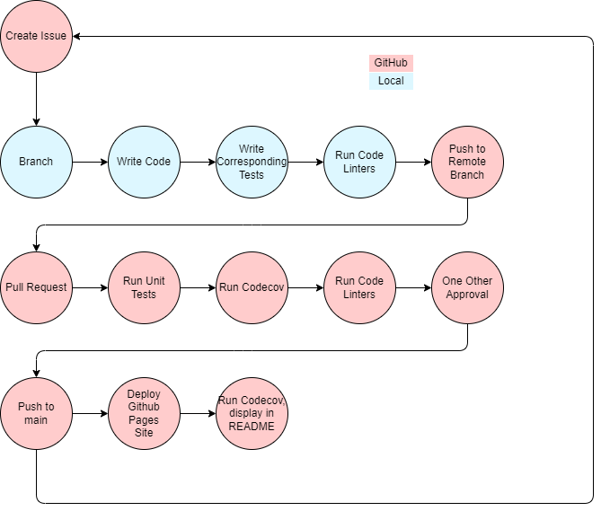

# Team 10x Phase 1 Build Pipeline
## Introduction
For our project, we opted not to use any fancy web app development 
frameworks, which leaves us with a very wide variety of tools to work 
with.

In [Tools Used](#tools-used), we list the tools we used to build our 
pipeline. In [Pipeline](#pipeline), we go through each step of the build 
pipeline, and what tools are used in which step. In [Future Plans]
(#future-plans), we go over some problems in our current pipeline, and 
things we may want to add in the future.

## Tools used
### Linters
- **HTMLHint** (HTML)
    - [A reddit commenter recommended it](https://www.reddit.com/r/node/comments/1ggr69o/what_are_the_best_linters_for_nodejs/)
- **Stylelint** (CSS)
    - [Has 11.2k stars on git](https://github.com/stylelint/stylelint)
- **ESLint** (JavaScript)
    - [Again, a reddit commenter recommended it](https://www.reddit.com/r/node/comments/1ggr69o/what_are_the_best_linters_for_nodejs/)

The more accurate reason for why these are the linters is because these 
were the first options we tried. Since setting them up was easy, and they 
properly detected bad code styling, we will just stick with them until we 
have a problem with them.

### Unit Tests
- **Jest**
    - We already have some prior experience with it in the lab, and test 
    cases are easy to write.

Like the linters, Jest is again easy to set up, and we don't really have 
a need to try out new testing frameworks yet.

### Documentation
- **JSDoc**
    - [Has 15.2k stars on git](https://github.com/jsdoc/jsdoc)

Same as others - popular, easy to set up, maybe there is some learning 
curve to writing high-quality documentation but we will get used to it.

### Deployment
- **Github Pages**
    - It's Github Pages

Deploying static pages with github pages is really easy, and Github gives 
us a domain for free as well.

## Pipeline
Below is a flowchart of our CI/CD pipeline:

Our build pipeline can start with or without an **issue**. If somebody 
decides they just want to add some documentation or test cases, we aren’t 
going to force them to create an issue just for the sake of creating an 
issue for every feature.

Once the feature idea step is passed, developers make a local **branch** of `main`. On the local branch, they **write code** with the help of local [linters](#linters) and [tests](#unit-tests). We want to have linters and tests running both locally and remotely through Github actions, since we don't want to overly clutter the repo's commit history with avoidable linting and testing failures. Once they have implemented the feature, they create a new **remote branch** and push to it. Then, they make a pull request to `main`.

When a **pull request** is opened, Github actions starts 3 jobs:
1. **Unit tests** are ran with [Jest](#unit-tests) to ensure new code isn't buggy
2. [HTMLHint, StyleLint, and ESLint](#linters) **linters** are ran to ensure the code adheres to our coding guidelines
3. **Human Review** is started.

Human review is a Github action that gets launched on every pull request to main. We highly encourage (but don't force) developers to add a `size` label to their pull request. A (s/m/l) labeled pull request requires (1/2/3) people other than the author to approve it. Once the required number of people approve the pull request, the human review check is passed.

In order for something to be **pushed to main**, it has to come from a pull request, and pass all 3 of these status checks. But whenever something does get pushed to main, a github action runs to **deploy the github pages site**, and **generate documentation** using [JSDoc](#documentation)

To ensure quality code, this is the entire process any piece of code must pass through to end up in our production branch.

## Future Plans
There are still some holes in our process that we want to address. For example, the human review action is kind of buggy - after the required amount of people review the pull request, someone needs to re-run the human review action, because it isn't done automatically.

Additionally, we need to figure out where to put documentation, since as of now, it is just hosted at `githubpagesite/docs/index.html`.

We also may want to consider a staging branch that gets pushed to very often, and push to main much less. This will make it easier to backtrack to a solidly working version of our project in case we ever find the need to.

Finally, we need to look more into "code quality tools." From what we understand now, they just seem like glorified linters, and we don’t want to overly complicate our pipeline with things that we don’t understand.