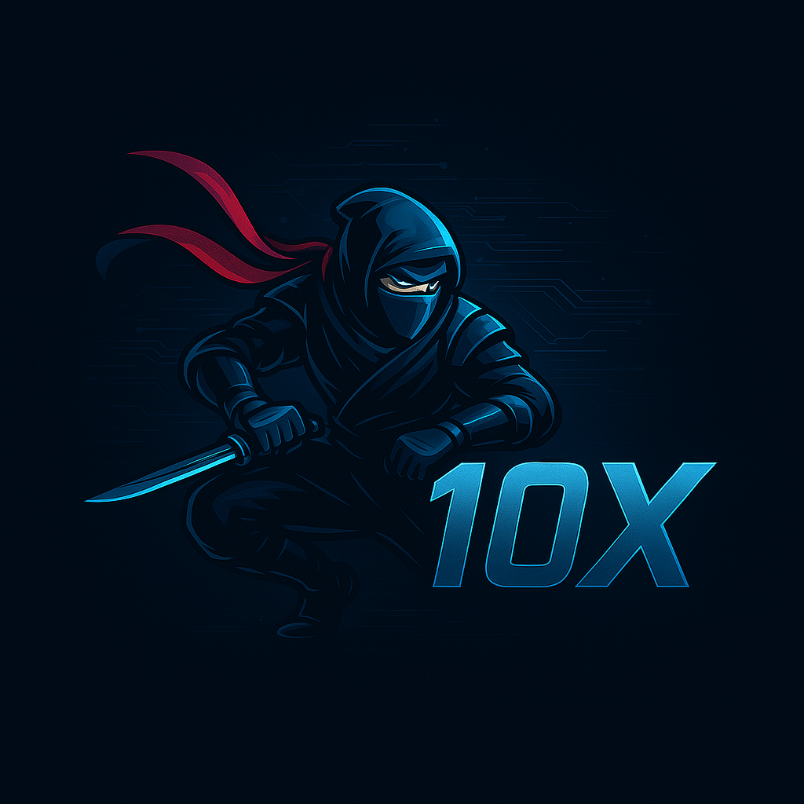

Team Page
In a previous lab exercise you made individual developer pages; now it is time to make one for your team.  This page will be for internal documentation, so ordinarily we would use a Wiki as opposed to GitHub Pages for your project since they are more internally focused.  Since Wikis are a paid feature for teams however, you'll just create a Markdown page in your /admin folder called team.md. You should link to this file from the README.md in your repository root.

Your team page should have the team name, brand, any values you think are important, and a roster of all the team members.  The roster should provide a brief overview of each member with a link to their personal Github page.  The team page can include humor or whatever culture makes sense to your team, but keep it reasonable as it may be shown to others. 

# Team 10X

## Brand

  

## Values
- **Innovation**: We strive to think outside the box and create 10X cutting-edge solutions.
- **Collaboration**: We believe in the power of teamwork and open communication.
- **Quality**: We are committed to delivering high-quality work that exceeds expectations.
- **Adaptability**: We embrace change and continuously learn to stay ahead.
- **Fun**: We enjoy what we do and create a positive environment for creativity.

## Roster 
| Name                       | Overview                       | Github                                                  | Introduction
| ---------------------      | ------------------------------ | ------                                                  | ----
| Ryan Kung (Team Lead)      | 4th Year Math-CS Major         | [kungryan](https://github.com/kungryan)                 | Growing up, I loved making things and solving problems which led me to enjoy both Mathematics and Computer Science. I'm passionate about gaming and am always interested in learning new things. I love exploring niche hobbies like pen spinning and typesetting.
| Nicholas Nurwinata (Team Lead)        | 3rd Year CS Major              | [Watermelonjar](https://github.com/Watermelonjar)       |Born in Indonesia, ask me about most compeitititve sports and I probably watch it to some extent, I love playing golf and going to the gym. I listen to a lot of techno, and I like to code where theres a lot of data to be processed! 
| Alan Shapow                | 4th Year Math-CS Major         | [503525](https://github.com/503525)                     | In 2023, I entered UCSD as a Math-CS Major in the hopes that I'd mostly focus on computer science. This decision led me to discovering an unexpected passion in mathematics. Outside of academics, I am *big* into music. I love widening my musical horizons, and I am always listening to new genres and styles. I also enjoy music composition and production. My other hobbies include reading, writing, and as of recently, learning new languages.
| Alex Pan                   | 2nd Year CS Major              | [alexp616](https://github.com/alexp616)                 | Hello! I grew up in New York City, where I went to high school. I'm interested in abstract mathematics and high-performance computing, and many of my past projects have been about the intersection between the two. In my free time, I like to study, play video games with my friends, and read manga.
| Audrey Elizabeth Fernandez | 2nd Year Computer Science Major                               | [audreyelizabethf](https://github.com/audreyelizabethf) | Hi! I’m Audrey! I’m a second year Computer Science major in Warren college here at UCSD! In my free time I like to crochet and I’m constantly learning new hobbies/crafts!
| Branden Sioson             | 4th Year Computer Science Major| [Pahsuleyk](https://github.com/Pahsuleyk)               | Born and raised in San Diego, I've been enamored with computers since I was young. My very first computer happened to be an old IBM personal computer and from then on I've been obsessed with the inner workings of computers which has led me on the path of Computer Science. My hobbies happen to be playing video games, building/upgrading PCs, art, and cosplaying. I always feel like theres a lot to learn with computers so I see any advince on the matter to be quite helpful. If anyone ever needs help building or upgrading a PC, I'm always willing to lend a hand.
| Eric Wang                  | 2nd Year Computer Science Major| [erw004](https://github.com/erw004)                     | From the Bay Area. Likes basketball, watching shows, and trying new freaky things. Academically interested in areas involving Machine Learning, especially if it involves robotics.
| Fong Yu Lin                | 3rd-Year Computer Science Major| [YangLin14](https://github.com/YangLin14)               | Originally from Taiwan 🇹🇼, I moved to California with my mother about five years ago. My academic path initially led me to Electrical Engineering, but my fascination with building software, exploring AI, and solving complex problems prompted a switch to Computer Science 💻. I thrive on learning new technologies and collaborating on impactful projects. I like outdoor activites and play sports under good weather 🚲 🏸 🏓. I also love watching anime and play video games in my free time 🎮.
| Johnson Chung              | 3rd Year ECE Major             | [JohnsonUCSD](https://github.com/JohnsonUCSD)           | Born and raised in San Diego in the City Heights area. I like to play video games and watch anime in my free time. At first I was into Architecture but then I found a passion for computers which lead me to Electrical Computer Engineering.
| Loreen Samaan              | 4th Year Bio Major + CS Minor  | [ltsamaan](https://github.com/ltsamaan)                 | Hi! I'm originally from Iraq but then moved to Turkey and finally the U.S. I started at UCSD wanting to be a doctor, but then realized how much I enjoy bioinformatics! I love developing software solutions to solve biological problems and hope to become a bioinformatics scientist. I spend a lot of my time with family, friends, and my two pet cockatiel birds. I also love to game in my free time. I'm really interested in learning about software engineering and excited to be working in such a large team! :)
| Taha Qamar                 | 3rd Year CS Major              | [taha-qam](https://github.com/taha-qam)                 | Hi! I'm from the Bay Area, specifically Fremont. I was always a computer geek growing up, and it was high school where my friends and I tried out Computer Science, going to hackathons and having fun in a team. College solidified my desire to study comp sci, giving me a chance not just to learn, but meet all sorts of people. When I find free time, I like to read (currently Dune, but usually anything sci-fi/murder mystery/political science), skateboard (trying to get better), and work out with my friends
